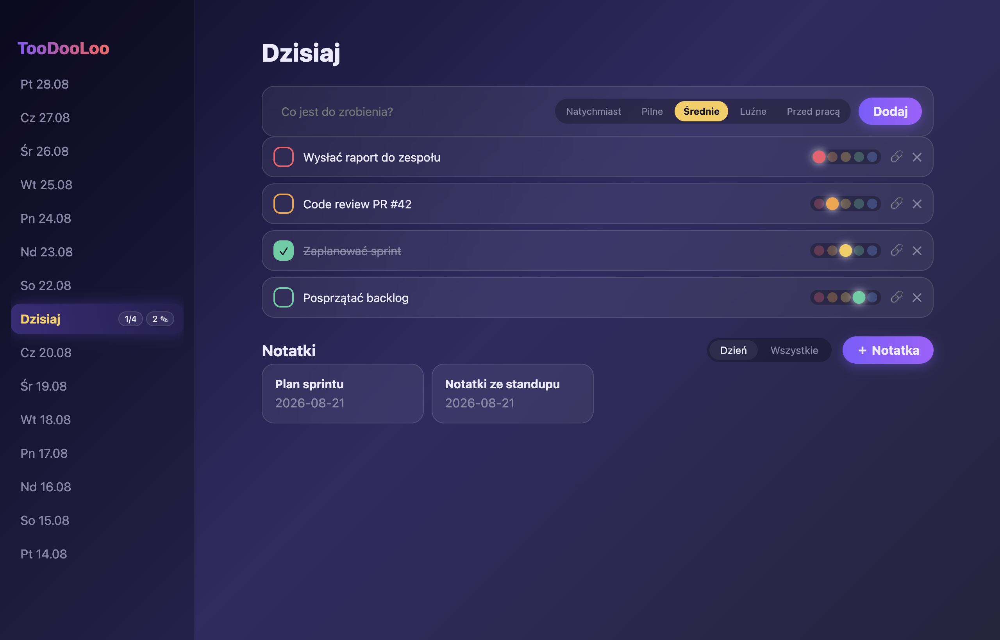

# TooDooLoo

Codzienna lista todo do pracy — Electron + React, z notatkami markdown i natrętnymi przypomnieniami.



## Feature'y

- **Dni po datach** w sidebarze; nieodznaczone todosy przechodzą na następny dzień
- **Todosy** z 5 poziomami pilności (jeden klik) i przypomnieniami: natychmiast → co 3 min, pilne → co 30 min, średnie → co 1h, luźne → co 4h, „przed pracą" → raz przed 9:00
- **Notatki markdown** przypisane do dnia, dostępne też globalnie, z podstronami jak w Notion; todos może linkować do notatki
- Dane trzymane lokalnie jako pliki (`todos.json` + `notes/*.md`)

## Rozwój

```bash
npm install
npm run dev        # dev z HMR
npm run test:e2e   # testy e2e (Playwright)
npm run build:mac  # build produkcyjny
```

Baza wiedzy: [CLAUDE.md](CLAUDE.md) · Plan: [docs/PLAN.md](docs/PLAN.md)
